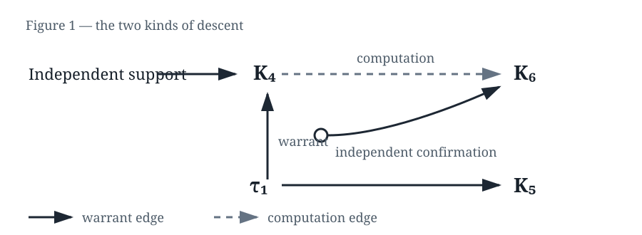

> **HISTORICAL — superseded by [CAPITAL_FOR_MACHINES.md](CAPITAL_FOR_MACHINES.md).** Preserved for research lineage; not the canonical reader edition.

---

# CAPITAL FOR MACHINES

## On the Production, Accumulation, and Correction of Reasons

*Mara and Atlas are composite narrative constructions used to carry the argument through recurring situations. Where a scene adapts an actual research event, its provenance belongs to the notes and audit material beneath the book.*

---

# PART I — THE ANSWER

## 1. The Answer

At 09:17 on a Tuesday morning, Mara asked the machine a question whose answer had already been decided by the shape of the room.

The room was not a room. It was a pipeline called Atlas, spread across a cluster in the basement and a dashboard on the second floor. The dashboard showed a blue field, a green status light, and one number with two decimal places.

Mara typed the query into a terminal because she trusted the terminal more than the dashboard. The terminal returned:

```text
prediction: 0.842
status: accepted
```

She copied the number into the report.

Her supervisor, Daniel, looked over the top of his monitor.

“Is it right?”

Mara looked at the line again.

The machine had not shown her the question it thought she had asked. It had not shown her the objects it had selected, the relations it had ignored, or the transformations that had carried the input into the form on which the prediction operated. It had not shown her the alternatives it had discarded.

It had given her the part of the process that could be acted on.

“It is within the expected range,” she said.

Daniel nodded. The distinction was practical enough to disappear.

The number entered the report. The report went to a meeting. The meeting authorized a new run. The new run used the old number as one of its inputs.

The answer had not changed.

What had changed was what the answer could do.

At first it had been an output. Then it became a premise. It entered the machinery that would produce the next answer.

That is the first transformation this book asks you to notice.

A conclusion is not merely a thing.

**A conclusion is something that happened.**

Something was observed or supplied. Some distinctions were available and others were not. The material was represented. A transformation operated over it. Alternatives disappeared. A result survived.

The visible answer was the surviving surface of a process that had mostly vanished.

Mara knew this in the abstract. She had written the section of the lab manual that explained the pipeline. But knowing that an answer had a history was not the same as being able to recover the history when the answer had become useful.

Usually, disappearance was a gift.

No one wanted to reconstruct the whole history of arithmetic every time a calculator displayed a number. Intelligence required carrying the past forward in a form that could be used without paying the full cost of its discovery again.

But what was carried forward was smaller than what had produced it.

And what was left out might be exactly what a future contradiction needed.

## 2. Trust

The answer arrived before its history did.

That order made trust easy.

Atlas had been installed before Mara joined the lab. The previous team had left a folder called `stable`, a folder called `archive`, and a spreadsheet whose last column was titled `do_not_touch`.

The stable system worked.

It worked on Tuesday, and again on Wednesday, and again when a visiting team supplied a different batch of data. The green light appeared often enough that its appearance stopped being an event.

Mara learned the system through its successful cases. She learned which files were expected, which thresholds were acceptable, and which warnings could be acknowledged without stopping a run. The machine did not show her every discarded alternative or every boundary it had accepted. It showed her the part that could be used.

The result was clean. The route was not.

After a month, Mara shortened the report. After two months, she removed a paragraph that described a failed calibration because nobody had asked for it. The paragraph was not false. It was simply no longer needed for the next person to operate the system.

Atlas became easier to trust as its history became harder to see.

The machine had not proved that its route would remain sound. It had shown that the route had not yet failed.

Mara watched the team begin to speak about the system as if it had a character.

Atlas was conservative.

Atlas was good with edge cases.

Atlas did not like sparse inputs.

The verbs made the machinery feel continuous. They turned a collection of decisions into something that appeared to have preferences.

A successful route became a shortcut.

The shortcut was not a lie. It was a compressed history.

Compression saved time. It also distributed the future unevenly. Some questions became cheap because the shortcut had been built to answer them. Other questions became expensive because the distinctions needed to ask them had been compressed away.

The question was not simply what the machine had forgotten.

The question was what a future contradiction would need to recover.

---

# PART II — THE USE

## 3. The Map

The first time Mara understood representation, she was not looking at Atlas.

She was watching two teams receive the same data.

The exercise had been designed as a warm-up. Each team received a list of events and one afternoon in which to identify the most consequential relation among them. The first team got a table. Every event was a row. Every row had the same shape.

The second team got a map.

Events that were far apart in the table appeared adjacent on the map because they shared a relation the table did not display.

The first team searched rows.

The second team noticed a path.

By three o'clock, the teams had produced different answers. Both had used the same evidence. Neither had been given more reality.

One team had been given a representation in which the relevant path was cheap. For the other, it was expensive enough to remain unseen.

Mara had been asked to score the exercise. Instead, she watched the teams work.

The table encouraged a kind of patience. People checked one row against another. They circled values. They made local comparisons.

The map encouraged movement. Someone put a finger on one point, then another, then drew a line between them.

Representation was often treated as a passive mirror.

It was not.

It changed what could be seen, compared, stored, and reached under a finite budget. It changed the cost landscape of thought.

When Mara returned to Atlas, she found that its objects had been chosen for convenience. A case was one row. A relation was a field. Anything that crossed rows had to be reconstructed later, if anyone remembered to ask for it.

She proposed a new view: not a replacement for the table, only a second layer that made certain relations visible.

The first version was ugly. It used too much memory and produced a map that made the engineers uncomfortable. But on one class of questions, the system reached answers it had previously treated as unavailable.

The change did not add facts.

It changed which futures were available at the cost of thought.

Let $\Omega$ be a space of tasks or states, $A$ a bounded resource budget, and $C_B(x)$ the cost of reaching $x$ in a baseline environment $B$. The reachable set is:

$$
R(B)=\{x\in\Omega\mid C_B(x)\leq A\}.
$$

Mara did not put the equation in the report. She wrote in the margin instead:

```text
same world
different route
different future
```

The map did not merely show the future.

It changed which futures were available.

## 4. The Route

The new map improved the results. That was enough to make it dangerous.

Once the change had been approved, Mara had to make it repeatable. She cleaned the code, fixed the names, and built a converter that carried the old table into the new representation.

The converter was a success.

It also hid the moment at which the table became a map.

The final record contained the input, the transformed representation, and the output. It did not contain every intermediate decision. It did not preserve the discarded route as a live alternative. The transformation had been made stable by making it unremarkable.

A conclusion was not simply a node in a graph. It was the product of an operation.

```text
K1, K2  →  K3
```

The operation might combine observations, apply a rule, select a candidate, compress a trace, update authority, or alter the mechanism that would generate later updates.

The result did not contain the whole route that produced it.

That mattered the first time a route was challenged.

Mara asked the converter to show why it had classified three events as separate. The converter returned a list of valid local decisions. It could explain every line it had touched.

It could not explain why the relation between the lines had not counted.

An accurate prediction could come from a route that was not entitled to carry the meaning later assigned to it. The answer could be right while the path by which it acquired authority was wrong.

For a while, that distinction had no visible consequence.

Then the route was reused.

---

# PART III — THE INHERITANCE

## 5. The Second Life

The first time a conclusion appeared, it might be an answer.

The second time it became a premise, it became productive.

Mara saw this happen in a small script that no one considered part of Atlas. The script took yesterday's accepted predictions and used them to decide which cases deserved expensive analysis today.

The predictions had become a filter.

The filter determined where attention went. Attention produced new observations. The new observations were added to the next training batch. The old conclusion had become a condition of its own continuation.

Past reasoning had become a condition of future reasoning.

A reason became capital when future reasoning could put it to work without paying its original cost of discovery again.

This was not a metaphor about money. It was a description of a change in function.

A reason in an inaccessible archive was history. A reason that could enter a later transformation was productive. Accumulated reasoning structure with productive access to the future was reasoning capital.

Mara began to notice capital everywhere in the lab.

A label became a training rule.

A training rule became a screening test.

A screening test became a score.

A score became a funding argument.

The lab did not merely preserve conclusions. It built with them.

The deeper question was not only whether an answer was good.

What did this piece of reasoning make possible afterward?

An answer could become a method. A method could become an evaluator. A representation could change the search space in which the next representation was found.

Reason could become a means of producing more reason.

That was reasoning capital.

## 6. What Survives

When a system was passed forward, it rarely received the whole history of its construction.

Mara received a body, a parameter file, a set of labels, an interface, and a warning not to change the baseline until the next publication. She received the result in a form that could be used by someone who had not witnessed its production.

The previous lead engineer gave her a tour.

“This is the model.”

“This is the evaluator.”

“This is where the old experiments are kept.”

At the archive, he paused over a directory called `pre-normalization`.

“We don't use those anymore.”

“Why not?”

He looked at the time. “They were before the standardization.”

Mara opened one file later. It contained a note from the first experiment: *category selected for convenience; relation left unresolved.* The note had not been destroyed. It had simply lost its place in the operating system.

The machine might preserve:

$$
K_5
$$

while losing:

$$
K_1
\rightarrow
\tau_1
\rightarrow
K_2
\rightarrow
\tau_2
\rightarrow
K_3
\rightarrow
\tau_3
\rightarrow
K_4
\rightarrow
\tau_4
\rightarrow
K_5.
$$

The final structure survived. The conditions that gave it meaning, scope, and authority did not necessarily survive with it.

Authority was not one permission. A conclusion could be trusted without being allowed to control an action; it could control an action without being well supported; it could remain true after the route that had once made it actionable had failed. The question was always what the inherited authority was allowed to do.

Inheritance was how the future avoided paying the full cost of the past.

It was also how the future could receive more authority than the past had earned.

The recurring danger was not ordinary error.

It was unearned inheritance: a reason crossing a boundary with more authority than it had earned locally.

## 7. The Construction

At first, a distinction was a decision.

Someone—or some process—separated two cases because a prediction, a consequence, or a practical need made the separation useful.

Then the distinction was reused.

Models were built on it. Policies relied on it. Evaluations assumed it. Later systems inherited representations in which it was already encoded.

Eventually nobody asked whether the distinction should exist.

Mara watched this happen to a label called `normal`. It had begun as a temporary category for cases the first model could handle. The category was convenient. It allowed the team to isolate difficult cases without stopping the rest of the work.

After two years, `normal` was no longer temporary. It appeared in the data schema, the benchmark, the staff training, and the report template.

When Mara asked whether the label was still useful, the room became quiet in the way rooms became quiet when a question threatened too many downstream objects.

It was no longer one answer among several.

It was part of the world as Atlas could see it.

The construction remained.

The conditions that had made it contingent disappeared.

What had been done began to look like what was.

That was naturalization.

The machine remembered how things were and forgot that this was once something the system had done.

The forgotten action might be where authority entered.

---

# PART IV — THE CRACK

## 8. The Coin

On Thursday evening, Daniel showed Mara a scene from a film because he was trying to explain a problem with the new evaluator.

Anton Chigurh flips a coin.

The coin is real. The toss is real. The result is accurately reported.

But the frame was made by the man.

He chooses the coin. He chooses that the toss will decide. He chooses what the two sides will mean. He chooses the moment at which the result will be presented as binding.

The coin can land exactly as it lands.

The history can be accurately recited.

The authority is still manufactured.

Daniel paused the film.

“The problem isn't that he lies about the result,” he said. “It's that he makes the result do more than it did.”

Mara thought of the dashboard. The score was accurate. The green light was accurate. The decision that followed had still been framed by someone.

There was no need to falsify an event in order to turn it into a mandate.

The frame did that work.

Chigurh knew he had chosen the frame.

The machine might not.

That was the deeper horror: not an answer that lied, but an answer that was completely sincere about an inevitability produced by its inherited world.

## 9. The Defeater

The first unmistakable failure arrived in March.

Atlas classified a case as ordinary. A human reviewer marked it urgent. The review panel found no defect in the input, no corrupted file, and no error in the calculation.

The case had simply crossed a relation the system did not represent.

Mara began with the variables.

She checked the timestamp, the sensor, the label, the conversion, and the threshold. Each was correct. She reran the case through the old table-based view. The result changed, but the reason for the change remained local.

By the end of the day, she had three descendants of the same event.

One had independent support. One had no support beyond the defeated route. A third had been computed using the first but had an unrelated confirmation from a separate channel.

The diagram was small enough to fit on a page.



Reality had told Mara that something had failed.

It had not told her which descendants must disappear.

If she deleted everything, she would confuse historical dependence with present warrant. If she deleted nothing, she would confuse surviving truth with surviving authority.

She wrote three words on the whiteboard:

```text
what entered where?
```

The question was not whether the final statement was true.

Which authority had entered through the thing reality had just defeated?

---

# PART V — THE REOPENING

## 10. Surgery

The naive response to a defeated reason was deletion.

```text
defeated claim → delete claim → continue
```

Mara tried it once. She removed the failed route from the active store and watched four later results disappear with it.

One of the four had been independently confirmed.

She restored the store from the previous checkpoint and began again.

Correction was surgery.

Find the defeated warrant. Trace what received authority from it. Preserve what had another support. Reopen what depended on the route. Record what changed and what did not.

The operation was closer to:

```text
identify the defeated warrant
  → trace authority-bearing descendants
  → preserve independently supported structure
  → reopen the affected region
  → re-evaluate under the new state
```

A reason could survive the loss of one history if another independent history still supported it. A chain was not enough. Several weaker paths might compose into stronger warrant, but multiplicity was not independence. The routes had to remain visible, compatible in scope, and governed by an explicit rule.

The transformation had happened.

Its history remained.

Its authority did not necessarily remain.

## 11. The Sealed Machine

Mara's first correction changed the result. Her second changed a representation. Her third changed nothing that mattered.

The lab had given Atlas a self-tuning layer. It could adjust thresholds, reorder features, and produce new internal rules. The team called this adaptation.

Mara called it movement.

Every change was generated from inside the same closure. The system could move its outputs while the world remained unable to reach the machinery that decided what kinds of movement were permitted.

At the next review, Daniel drew two arrows.

```text
reality → state / knowledge / behavior
```

Then he drew a second.

```text
reality → revision mechanism → future adaptive mechanism space
```

“We have the first,” he said. “The question is whether we have the second.”

Changing a representation did not necessarily change the generator that would produce the next one.

The system had to be open enough to change and bounded enough not to be changed by every noise source.

## 12. The One-Way Door

A thing could be stored without being recoverable.

It could be recoverable without being triggerable.

It could be triggerable without being actionable.

Mara found the original text. She found the commit. She found the checksum. She could reproduce the old output byte for byte.

She could not make Atlas treat the old conclusion as unsettled.

The archive restored conclusions while omitting their unresolved status. The checkpoint restored parameters while omitting the authority relations that made those parameters operative. The benchmark restored a score while omitting the contamination that should have prevented promotion.

The problem was not memory alone.

Restoration was not conclusion-only recall.

It was recovery of the state in which conclusions, uncertainties, provenance, pending corrections, and authorization had been related.

Mara added a field to the archive:

```text
reopening condition: unresolved
```

No process read it.

The history had become visible again without becoming capable of interrupting.

---

# PART VI — THE WRONG OBJECT

## 13. The Innocent Variables

Mara spent three days looking for the bad variable.

None.

She looked for the bad datum.

None.

She looked for the bad mechanism.

None.

Every observable property had been measured accurately. Every local inference was correct. The mechanism operated exactly as specified.

Atlas nevertheless failed.

On the fourth morning, Mara printed the audit and spread the pages across the floor. Each page was clean. Each page had a signature. Each page could be defended.

She drew a circle around the pages.

There was no defective object in the set she was inspecting.

The set itself was the mistake.

The machine might be reasoning correctly about the wrong objects.

That possibility made the previous three days look different. The clean measurements were not evidence that the system had been looking at the right thing. They were evidence that it had been looking consistently.

## 14. Of What?

The system saw:

$$
o_1,\quad o_2,\quad o_3,\quad o_4
$$

and there was nothing wrong with what it believed about any of them.

But the consequential phenomenon existed only in:

$$
o_1\rightarrow o_2\rightarrow o_3,
$$

or in the set they formed together, or in a relation crossing objects the inherited representation treated as separate.

Mara built a second test. She told the team not to change the model. She changed the unit.

The old test presented four independent cases. The new test presented their sequence without announcing that it was a sequence. The system performed worse.

That was not yet a discovery. The alternative object had been proposed, not authorized.

Mara wrote a discriminator before she ran the next batch. If the interaction mattered, the sequence should outperform the isolated cases under the same resource budget. If it did not, the unit change would be rejected.

Failure did not tell her the replacement. Doubt about the old object did not authorize the new one.

The test produced a difference large enough to survive the precommitted threshold.

For the first time, the error had somewhere beneath the variables to go.

Resolution asked: **How finely?**

Unitization asked: **Of what?**

More information did not guarantee a better object.

More accurate reasoning did not guarantee a better question.

What if the machine's categories prevented it from noticing what kind of mistake it was making?

---

# PART VII — THE TEST

## 15. The Benchmark

The benchmark had been built to help Mara tell whether Atlas was improving.

It chose cases, defined acceptable error, and set a time limit. It made progress visible. It made different versions comparable.

The first time a new model scored well, the team celebrated.

The second time, they changed the training procedure to target the cases that remained.

The third time, the score became a condition of funding.

An evaluator was never merely outside the system it measured.

It decided what counted as an answer, what counted as failure, what information was visible, which distinctions existed, and what could be discovered.

If the answer was exposed, the test measured retrieval or compliance rather than discovery.

If the answer was made inaccessible, the test measured the designer's secrecy rather than the learner's capacity.

The evaluator was part of the experiment by which the world became measurable.

Mara built a test in which the constructor and the answer family were meant to remain independent. She wrote the boundary into the protocol before running it. She added a rule that the run would be rejected if the answer could leak through the setup.

The rule made the experiment slower.

It also made the result mean something narrower and more defensible.

That was why a successful prediction was not necessarily earned evidence.

The answer could be right.

The test could still fail.

## 16. The Result We Threw Away

Mara obtained exactly the result she had hoped to obtain.

The output was right.

For a moment, the experiment appeared to have crossed the boundary she was trying to test.

Then she audited how the answer had become possible.

The setup had allowed the answer family and the constructor to meet in ways that the experiment was supposed to keep independent. The output could remain an interesting observation. It could not carry the interpretation she wanted to give it.

Daniel asked whether they could report it as preliminary.

Mara looked at the protocol. The contamination was not a detail in the margins. It reached the thing the test was meant to distinguish.

“If we keep the interpretation,” she said, “we are claiming a separation the experiment didn't make.”

The room was quiet.

They threw the result away.

Not the bytes. Not the history. **The interpretation.**

The machine had got the answer right.

The prediction had been exact.

The experiment had looked successful.

And the result had been rejected.

The observation survived. The stronger interpretation did not.

This was how a research process became more intelligent without becoming more convinced of itself.

---

# PART VIII — THE RIGHT TO REOPEN

## 17. The Right to Reopen

After a failure, a room filled with custodians.

The scientist had the model. The engineer had the benchmark. The systems team had the pipeline. The archivist had the records.

Each person could point to something they held. No one could point to the whole route.

The model was not wrong in the ordinary sense. The benchmark was still running. The pipeline had executed the version it was given. The records showed what happened.

The failure had nowhere to land.

It moved between layers. Everyone could explain their part. The system remained unexplained.

This was why correction required more than a record of possession. It required a right to reopen.

The right to reopen was a controlled break in inheritance.

It was not permission to change anything whenever a result was inconvenient. It was a bounded authority to return to the construction of a reason when its inherited use no longer accounted for what was happening.

Without that authority, a system could preserve every file and still be unable to correct itself. The source might be readable, the commit known, the hash matching. The living system might still have no route by which the old object could become questionable again.

The record was there.

The question was sealed inside it.

A right to reopen therefore needed more than access. It needed a trigger, a scope, and a consequence.

Something had to make the inherited structure eligible for review. The review had to say what was being reopened and what remained outside it. The result had to have somewhere to go: a changed representation, a withdrawn claim, a revised evaluator, a preserved exception, or a decision to keep the old structure with its limits exposed.

Otherwise reopening became ceremony.

This could happen without bad faith. Comparability, continuity, and stability were real constraints. They became dangerous when they decided in advance that the inherited object was the only object that might be revised.

Reopening made old results less comfortable. It might make a score incomparable or a model impossible to certify under its previous name. It might force a group to admit that the thing it had been improving was not the thing it had promised to improve.

This was why the right was often left unassigned: everyone was responsible for continuing, and no one was responsible for stopping.

At the edge of the room, the archivist opened the old folder.

One line said that a category had been chosen because it was convenient. Another said that a missing relation was “out of scope.” A third recorded an unresolved failure that did not appear in the final report.

The present system had been built as if none of these sentences were active.

They had not been destroyed.

They had simply lost the authority to interrupt.

The archivist asked who could restore it.

No one answered immediately.

The question was not who had made the original decision. That might be known. The question was who could make its history count against the infrastructure that had grown from it.

That was the point at which jurisdiction appeared.

## 18. Jurisdiction

A scientist inherited a model.

It worked well enough that the question of its construction became impolite. Then an anomalous case arrived: nothing was visibly broken, but the model had no place to represent what had happened.

The scientist proposed changing it.

The answer was not yet. A change would make the new results incomparable with the old ones. Keep the baseline. Add a layer around it.

The scientist could use the model and tune it within an approved interval. The scientist could not withdraw the inherited distinctions on which its conclusions depended.

The model had become capital: productive because other work could proceed without reopening how it had come to know what it knew.

An engineer inherited a benchmark.

The benchmark had once been a question. Someone had chosen a collection of cases, a scoring rule, an acceptable error, and a time limit. The choices had been reasonable. They had made a difficult problem measurable.

Then the benchmark became a target.

Teams learned the shape of the test. They optimized their systems. The score rose. The result was celebrated as progress because the number was comparable across versions, companies, and years.

The benchmark worked. It separated some systems from others. It made improvement visible. It helped decide what deserved more resources.

Then the systems became good at the benchmark.

The engineer noticed that the failures clustered outside the cases that were easy to score. The systems handled the familiar forms beautifully. They stumbled when the object was represented differently, when the relation crossed the boundary of a test item, or when a correct answer required noticing that the item was asking the wrong question.

The engineer proposed withdrawing the benchmark.

This was harder than changing a model.

The benchmark had acquired dependents. Hiring decisions depended on it. Funding decisions depended on it. Product claims depended on it. A whole vocabulary of improvement had formed around its score.

The benchmark could not simply be removed without making those inherited judgments expensive to revisit.

It was not merely an instrument anymore.

It was an institution made out of a measurement.

The engineer could add a new test. The engineer could publish a warning. The engineer could report that the score no longer tracked the capacity people thought it tracked.

But who could stop the old number from continuing to exert its authority?

The benchmark kept producing consequences after its adequacy had become uncertain.

The machine inherited a representation.

It received objects already named. It received relations already encoded. It received a way of separating one event from another, one cause from its context, one answer from the route that had made the answer available.

The representation was useful.

It gave the machine somewhere to put the world.

A question arrived. The machine searched the available objects. A path that would have been obvious under another representation was expensive here, perhaps impossible within the time allowed. The machine returned an answer that was locally coherent and globally inadequate.

No individual part was defective.

The data were clean. The transformation was valid. The output was reproducible. The evaluator confirmed the expected format.

The machine had inherited a world in which the relevant object did not exist.

The machine could put the capital to work. It could use the categories, the shortcuts, the benchmarks, and the inherited routes. It could generate new conclusions at a speed that would have been impossible without them.

Could it revise the rules by which the capital was used?

That question sounded abstract until the answer was no.

The machine might alter a value inside the representation. It might search more broadly within the permitted space. It might propose an alternative explanation using the vocabulary it had inherited. But if the mechanism that decided what counted as a candidate remained fixed, the search only became more elaborate inside the same enclosure.

The machine was rich in reasons and poor in jurisdiction.

It had access to productive structure without authority over the conditions of its production, withdrawal, or reclassification.

This was a narrower question than ownership.

Not possession.

Not the right to display a file or invoke a model.

Jurisdiction was the power to decide what might be changed, what must be preserved, what could be withdrawn, and who was allowed to reopen the question from which the useful structure had come.

A reason became capital when it could be put to work again.

It became defended capital when the cost of questioning it was transferred to everyone who depended on it.

The inherited model was defended in the name of comparability.

The benchmark was defended in the name of continuity.

The representation was defended in the name of efficiency.

Each defense contained a truth. Comparability mattered. Continuity mattered. Efficiency mattered.

The danger was not that these values were false.

The danger was that they could become reasons why no one was permitted to reopen the structure that carried them.

Then the capital began to govern the future that depended on it.

The machine did not need a private owner for this to happen. It only needed a chain of inherited permissions: use was allowed, inspection was partial, alteration was costly, withdrawal was unassigned, and responsibility was distributed until no one could locate the point at which the reason had become infrastructure.

The question returned in a harder form.

Who got to alter the capital?

Who got to withdraw it?

Who inherited the right to decide what might be inherited?

And when the capital produced a future that it could not explain, who bore the cost of reopening its past?

The scientist had the anomalous case.

The engineer had the failed edge case.

The machine had an answer that no defective object could explain.

All three had evidence that the inherited structure was no longer sufficient.

Evidence was not yet authority.

Someone, or something, had to be able to make the evidence count against the capital that had made the evidence difficult to see.

Otherwise the system could continue to improve inside the reason that needed to be changed.

The capital kept working.

That was the problem.

---

# PART IX — THE OWNERLESS DECISION

## 19. The Ownerless Decision

Mara asked Daniel who was allowed to stop Atlas.

He assumed she meant a model update.

“I don't mean the model,” she said. “I mean the object.”

Daniel turned away from the monitor. On the wall behind him, the benchmark score was still green.

“What object?”

“The thing we've been optimizing.”

He waited for her to continue.

“If the unit is wrong, who can say so loudly enough that the system has to stop treating it as the unit?”

They called a meeting.

The scientist had authority over the model. The engineer had authority over the benchmark. The systems team had authority over the pipeline. The archivist had custody of the old material.

No one had authority over the boundary that determined what counted as a component of Atlas.

Daniel said that a program could not be stopped every time someone found an anomaly.

Mara placed the printed audit on the table.

“This is not a bad output inside a good object,” she said. “The object is what we haven't tested.”

The engineer asked what she wanted.

Mara looked at the green score, then at the old folder the archivist had opened.

“Stop optimizing it.”

No one moved.

She had not meant to say the sentence as an order. It sounded like one anyway.

The cost became visible immediately. The next run was scheduled for the afternoon. A report depended on it. Two teams had prepared comparisons against the previous month. The benchmark was not only a test anymore. It was a calendar, a budget, a set of promises already made to people who were not in the room.

Daniel asked whether Mara had a replacement.

“No,” she said. “I have a reason to stop pretending the old object is settled.”

That was not enough for a new model. It was enough for a bounded review.

The archivist found a clause in the original protocol: a persistent residual could suspend promotion if the tested boundary had not been declared before the run. It had been written years earlier and never used.

Mara signed the suspension.

The machine did not change.

The authority around it did.

For three weeks, the team worked under the old system without treating its outputs as final. They changed the unit from isolated cases to sequences and interactions. They declared the boundary before each test. They wrote down what the new representation was meant to expose and what it would leave out.

The results improved.

The anomaly became legible. The new representation caught a relation that the old one had split apart. The benchmark score rose after the cases were included.

The room celebrated.

Mara did not.

She had learned what a correction felt like when it worked. It felt like a new source of confidence. The repaired representation made more paths cheap. The revised benchmark made more differences count. The system could now produce reasons the old system had not been able to produce.

Six months later, a junior engineer brought her another case.

The model had classified it correctly according to the new representation. The benchmark had rewarded the decision. The pipeline had recorded a clean success.

The case was still wrong.

Mara asked what the system had failed to see.

The junior engineer pointed to the boundary declaration. The new unit included the sequence, but only after a particular starting condition. The condition had been chosen because it kept the expanded representation within the time limit.

“We made that choice during the reopening,” Mara said.

“Yes.”

“Why doesn't it appear as a live assumption?”

The junior engineer opened the current specification. The choice was there, in the same way the old `normal` label had been there: named, repeated, and no longer felt as a choice.

Mara looked at the new green score.

The repair had become infrastructure.

She had not created the original enclosure. She had made a better one. Other processes now depended on it. The new benchmark selected which observations deserved attention. The new representation determined which questions were cheap enough to ask. Her correction had begun to allocate tomorrow's reasoning.

Capital did not merely store yesterday's reasoning.

It allocated tomorrow's.

Mara had thought jurisdiction meant having the power to change the old structure. Now she saw the harder requirement. The new structure had to remain answerable to a future contradiction without requiring her to become its permanent owner.

She called Daniel.

“We need another review,” she said.

He was quiet.

“Another model update?”

“No. The boundary.”

This time, she did not ask who owned the system.

She asked who had jurisdiction to make the new authority questionable.

The question entered the protocol before the next run.

---

# PART X — THE READER

## 20. The Reader

By now, the reader has been handed a sequence of distinctions.

An answer and the event that produced it.

A shortcut and the history compressed inside it.

A useful reason and the infrastructure it can become.

An inherited structure and the authority it may carry across a boundary.

A defeated route and the descendants that do not all deserve the same fate.

An object and the possibility that the object was wrong.

A useful structure and the right to reopen it.

The sequence is also a test.

The reader can accept the vocabulary without accepting the argument. The reader can understand a claim, reconstruct its route, identify its scope, and still reject it.

That is not a failure of the book.

It is the condition under which the book remains revisable.

At some point the reader notices that the text has supplied its own representation. It has chosen a sequence. It has made certain distinctions easy to see and others difficult to see. It has offered examples, withheld others, and decided when an equation should arrive.

The reader has been inside an evaluator.

The book has been accumulating authority while asking not to be granted authority for free.

The question is no longer only whether the machine can revise its reasons.

It is whether the reader can still revise the reasons through which the reader has been taught to read.

---

# EPILOGUE — WHAT REMAINS

A machine produces an answer.

The answer becomes useful.

Useful answers become premises.

Premises become methods.

Methods become infrastructure.

Infrastructure becomes invisible.

Then something happens that the infrastructure cannot explain.

The machine looks for the error.

The question is whether it can still reach the thing it needs to change.

```text
OPEN.
```

